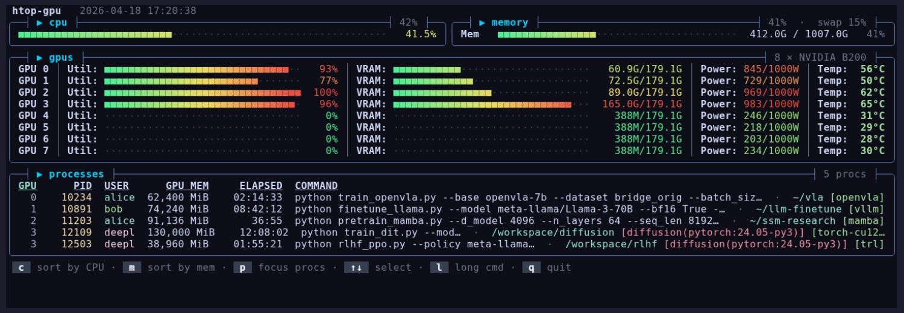

<div align="center">

# htop-gpu

**NVIDIA GPUs, system CPU/memory, and processes in one terminal dashboard** — each process annotated with its conda env, docker container, and working directory.

[](https://pypi.org/project/htop-gpu/)
[](https://pypi.org/project/htop-gpu/)
[](LICENSE)

[Install](#install) · [Usage](#usage) · [Keys](#keys) · [Why](#why)



</div>

## Install

```bash
pip install htop-gpu
```

```bash
htop-gpu          # one-shot snapshot
htop-gpu -w       # watch mode
hgpu -w           # short alias
```

Linux, Python 3.9+, NVIDIA driver. Uses NVML (fast) when available, falls
back to `nvidia-smi`.

## What it does

- **GPUs, CPU/memory, and processes** in one screen
- **Click any panel title** to switch what the process table shows
  (`cpu` / `memory` for top system processes, `gpus` for GPU-only,
  `processes` to fullscreen the table)
- **Click column headers** to sort
- **Click a process row → press `k`** to send `SIGTERM` (falls back to
  `sudo kill` with a password prompt if you don't own it)
- **Conda env, docker container, tmux session** shown next to each
  command, so you can tell at a glance whose stray process is hogging
  GPU 5
- **Adaptive layout** — drops decorations as the terminal shrinks; it
  keeps the GPU + CPU/Mem panels visible even on tiny windows

## Usage

Watch mode is mouse-driven. Everything is also keyboard:

| key                      | what it does                               |
|--------------------------|--------------------------------------------|
| `c` / `m` / `p`          | switch to cpu / memory / focus-procs view  |
| `Esc`, `←`               | back out (clears mode / focus / selection) |
| `↑` `↓`                  | move selection                             |
| `k`, `F9`                | kill selected process                      |
| `l`                      | toggle full command lines                  |
| `0`–`9`                  | filter to that GPU index                   |
| `q`, `F10`, `Ctrl-C`     | quit                                       |

Mouse uses SGR mouse mode (`\x1b[?1006h`) — works in iTerm2, Kitty,
WezTerm, Ghostty, Alacritty, Windows Terminal, modern xterm/Konsole, and
tmux with `mouse on`.

For scripts:

```bash
htop-gpu --json | jq '.processes[] | select(.gpu_mem_mib > 10000)'
```

## Why

I needed to know *which conda env* or *which docker container* a stray
python process on GPU 5 belonged to. None of the other GPU monitors I
tried (nvtop, gpustat, nvitop) showed that, so this exists. The
mouse-driven mode switching and process-kill shortcut grew out of using
it daily.

## Credits

UI takes inspiration from [htop](https://htop.dev),
[btop](https://github.com/aristocratos/btop), and
[nvtop](https://github.com/Syllo/nvtop). Independent project, not
affiliated.

## License

[MIT](LICENSE)
